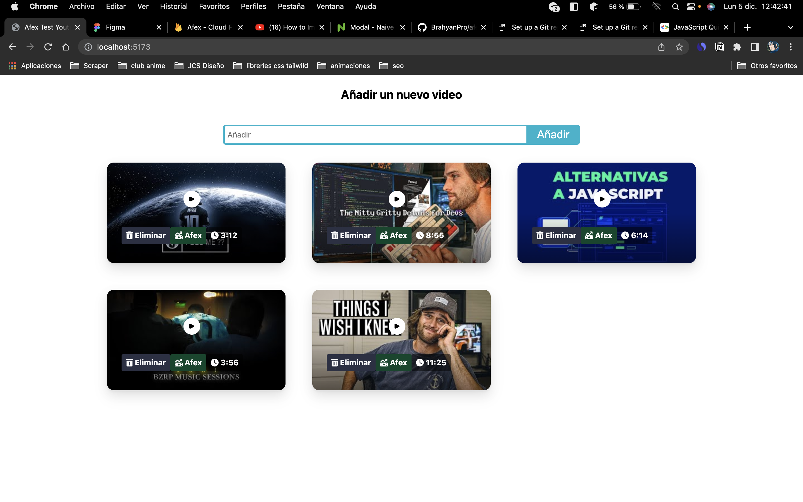
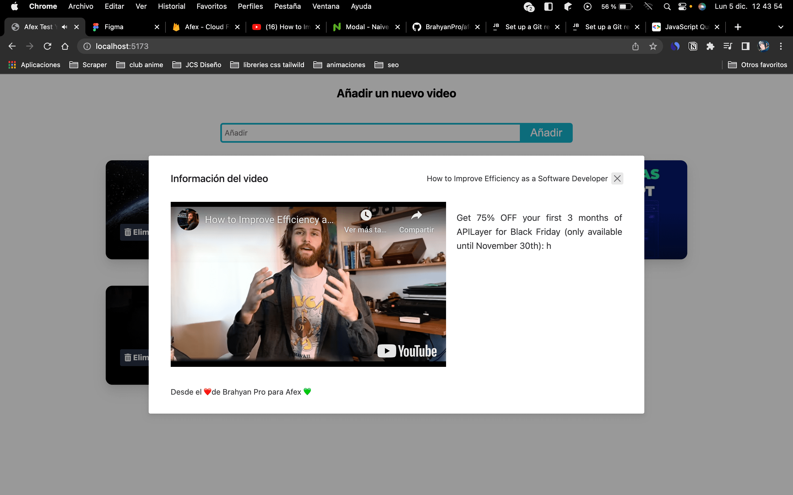
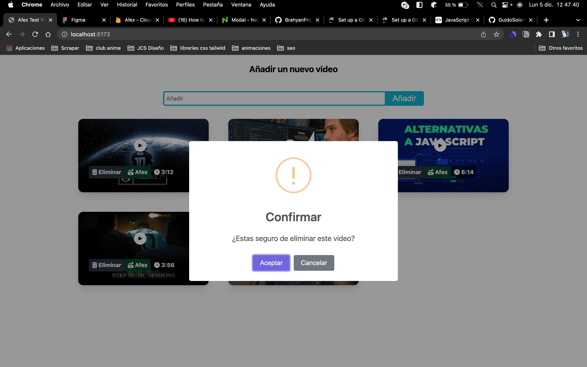

# Test Apex Youtube API

Esta prueba se basa en el ejemplo de [Youtube Data API v3 Quickstart for js](https://developers.google.com/youtube/v3/quickstart/js)

## Screenshots

## Puntos a mejorar

- [ ] Agregar etiquetas de los videos y poder filtrar por ellas
- [ ] Agregar un buscador de videos
- [ ] Mostrar las vistas del video
- [ ] Ordenarlos segun varios parametros que se decidan necesarios ej : vistas, fecha de subida, etc
- [ ] Libertad creativa, si no sera un figma hermoso mejor dejar la libertad de hacer lo que uno quiera, o pasar el figma y a la vez dejarlo claro en el pdf
